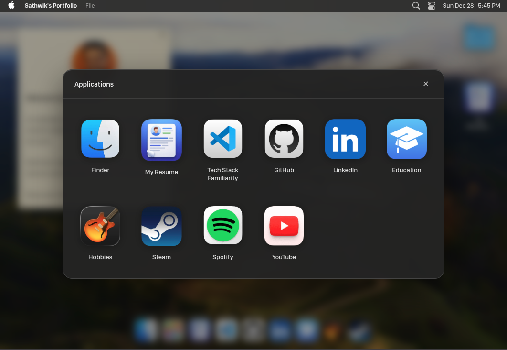
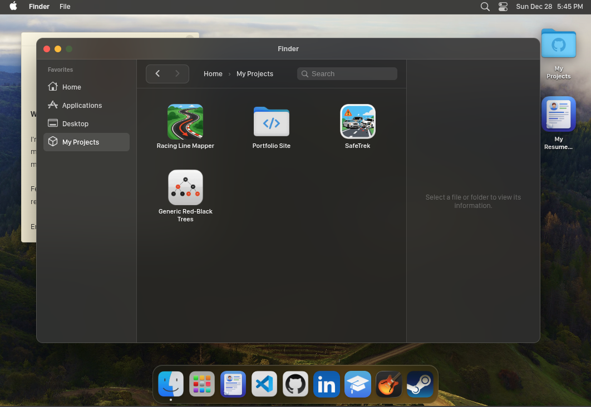

# macOS-style Portfolio

A high-fidelity personal portfolio website that recreates the macOS Sequoia/Sonoma desktop interface using Vue 3. This project focuses on authentic interaction design, system architecture simulation, and responsiveness.

Currently hosted at https://7wik-pk.github.io/portfolio/

## Example screenshots:

### Desktop


### Launchpad (App Drawer)


### Finder


## 🏗️ Architecture & Technical Implementation

### Dynamic Window Management 🪟
The core of the desktop experience is a robust window management system handled in `App.vue`:
- **Registry & State**: Windows are tracked in an `openWindows` array.
- **Z-Index Stacking**: A separate `windowStack` array tracks the focus order. The currently focused window is always at the end of the array.
- **Dynamic Layering**: The `z-index` is computed dynamically (`base + index`), ensuring the active window is always on top. Clicking any window brings it to the front by moving its ID to the end of the stack.
- **Component Injection**: Windows dynamically render content using Vue's `<component :is="...">` based on the registry configuration.

### System Registries 🗄️
The application is data-driven, separating configuration from logic:
- **`config/apps.js`**: Centralized registry for all applications (Finder, Launchpad, Spotify, etc.), defining their icons, responsive behavior, and launch actions (commands vs links).
- **`config/finder.js`**: A mock file system structure simulating hierarchical folder navigation for the Finder.

## ✨ Key Features

### 1. Desktop Experience
- **Stickies Note**: A draggable, editable sticky note component.
  - *Authentic Feel*: Uses `contenteditable`, yellow paper texture, and drop shadows.
  - *Responsiveness*: Repositions on mobile; includes a secondary "Mobile Disclaimer" note on small screens.
- **Context Menus**: Functional custom dropdowns for the Apple Logo and "File" menu.
  - *State Awareness*: The "File" menu automatically greys out when no windows are open.
  - *Actions*: "Close Window", "About Me", and "Source Code" links.
- **Dynamic Wallpapers**: Randomly cycles through high-quality wallpapers on load.

### 2. The Dock 🚀
- **Physics**: Implements a "bounce" animation on app launch.
- **Launch Simulation**: Adds a realistic 300ms delay before windows appear.
- **Active Indicators**: Persistent white dots under running applications, managed via global state.
- **Smart Launchpad**: Toggles the App Drawer; auto-closes if an app is launched.

### 3. Finder (File System) 📂
- **Navigation**: Full breadcrumb navigation and "Back" button history stack.
- **Mobile Optimization**: Implements a "Smart Tap" system for touch devices—tapping an already selected item opens it, solving double-click reliability issues on mobile.
- **Visuals**: Uses high-res icons for sidebar items and file previews.

### 4. Menu Bar 🕰️
- **Context-Aware**: The bold application title (e.g., **Finder**, **Preview**) updates dynamically based on the currently focused window.
- **Live Clock**: Accurate day, date, and time display.

### 5. Toast Notifications 🍞
- A custom global notification system for "Coming Soon" features.
- handled via a centralized event bus (`showToast` helper).
- Features glassmorphism styling, timeout management (resets on multiple clicks), and manual dismissal.

## 📱 Responsiveness & Optimization
- **Dark Mode**: Configured with `color-scheme: dark` metadata to prevent extensions like Dark Reader from interfering with the native design.
- **Mobile Adaptations**:
  - The Dock shrinks and hides non-essential apps.
  - Sticky notes reposition and toggle content based on screen size.
  - Finder switches interaction models (Double-click -> Tap-to-Open).

## 🛠️ Tech Stack
- **Framework**: Vue 3 (Composition API)
- **Build Tool**: Vite
- **Styling**: Vanilla CSS (Scoped) with extensive usage of `backdrop-filter` for glassmorphism.
- **Fonts**: SF Pro Display (Project-hosted assets).

## Acknowledgements

I found most of the MacOS icons on https://www.macosicongallery.com/ and https://macosicons.com/ - I'm naturally grateful to the creators responsible for making them available on these sites.

This project was almost entirely vibe-coded, thanks to Google Antigravity & several models (I jump from one to another when I exceed free usage quotas because I'm stingier than an Indian housewife in the Sunday market).

## Setup
```bash
npm install
npm run dev
```
