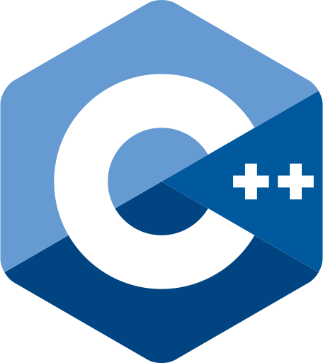
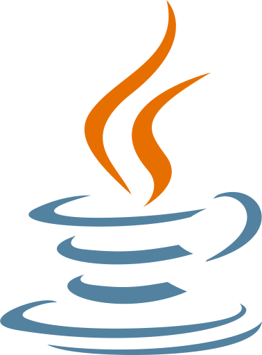

# Languages & Frameworks

### Languages

  
  
  
  
  
  

- **Go**: Used for performance-critical components and backend logic (e.g., Racing Line Mapper).
- **Python**: Proficient in building scripts, data analysis, and RL agents.
- **C/C++**: Strong foundation from undergraduate studies and embedded systems.
- **Java**: Solid experience with Java Foundations and enterprise-level concepts.
- **JavaScript/TypeScript**: Experienced in building modern web applications like this portfolio and internet apps.
- **Kotlin**: Mobile and distributed systems development.
- **SQL**: Advanced database management and optimization.
- **Bash/Linux**: Power user, comfortable with automation and system administration.

### Frameworks & Libraries

  
  

- **Gin**: Feature-rich web framework for building RESTful APIs in Go.
- **Vue.js**: Used for building reactive and performant user interfaces.
- **Vite**: Modern build tool for fast web development.
- **Node.js**: Backend JavaScript runtime for scalable applications.
- **PyTorch/TensorFlow**: Foundations in machine learning and neural networks.
- **Maven/Gradle**: Project management for Java/Kotlin.
