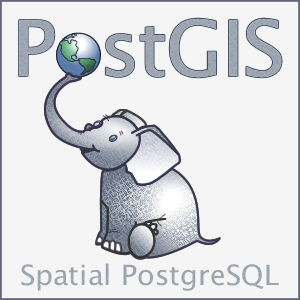
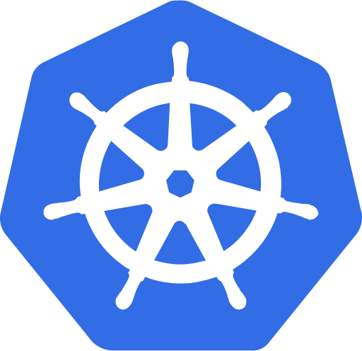

# Domain Knowledge

### Computer Science (Theoretical Knowledge)
- **Data Structures**: Proficient in implementing and optimizing data structures.
- **Algorithms**: Experience with algorithm design and optimization.
- **Computer Networks**: Understanding of network protocols and security.
- **Computer Architecture**: Experience with low-level programming and hardware interfacing.
- **Operating Systems**: Understanding of operating system concepts and security.

### Software Engineering (Practical Skills)

  
  
  
  
  
  
  

- **Geospatial Data Processing**: Experience with GIS and spatial analysis (using PostGIS).
- **Database Management**: Proficient in database design and optimization.
- **Backend Development**: Experience with building scalable and secure backend systems (primarily in Golang and Python).
- **Cloud Computing**: Deploying and managing applications on cloud infrastructure using various cloud resources (primarily on OCI and AWS).
- **Containerisation**: Experience with containerisation and orchestration (primarily using Docker and Kubernetes).
- **Digital Image Processing**: Implementing algorithms, filters and operators for image processing and computer vision.
- **Discrete Optimization**: Solving complex scheduling and routing problems.
- **Multi-Agent Systems**: Designing and simulating autonomous agents.
- **Mobile & Distributed Systems**: Building resilient and scalable mobile applications.

### Embedded & Hardware
- **Embedded Systems**: Low-level programming and hardware interfacing.
- **Digital Communication**: Deep understanding of signal processing and network protocols.

### Artificial Intelligence

  

- **Reinforcement Learning**: Experience with Q-Learning and tuning agent behavior.
- **Neural Networks**: Understanding of architecture and training processes.
- **Machine Learning**: Experience with fundamental ML algorithms and building and training models.
