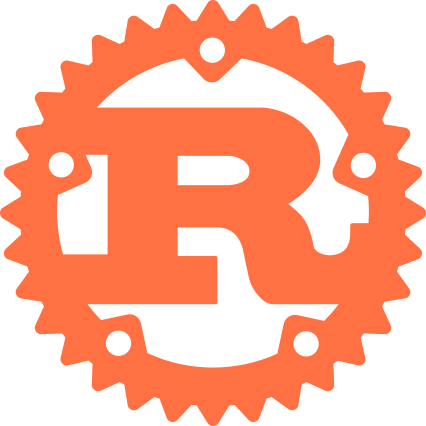
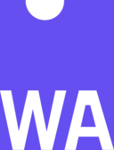

# Interested in Learning

### Technologies I Wish to Explore

  
  
  
  
  

- **Rust**: For high-performance, memory-safe and thread-safe systems programming.
- **Zig**: For low-level programming with a focus on simplicity and performance.
- **Lisp**: For exploring functional programming at a deeply theoretical level and improve my programmatical thinking/instincts.
- **Deep Q-Networks (DQN)**: Advancing from basic reinforcement learning to deep RL.
- **WebAssembly (WASM)**: Bringing near-native performance to the browser.
- **Blockchain (Web3)**: Understanding the fundamentals of blockchain technology to build the next generation of financial applications.
- **Kubernetes**: Mastering container orchestration at scale.
- **Infrastructure as Code (IaC)**: Automating the deployment and management of infrastructure (Terraform/Pulumi).
- **Performance Engineering**: Deep dive into optimizing software for maximum hardware efficiency.
- **Embedded Systems**: Low-level, low latency and low power programming for mobile systems on batteries.
